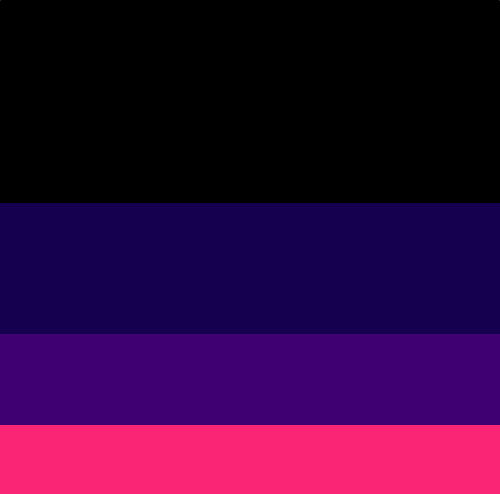
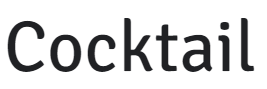
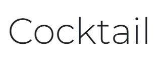

# Cocktail's CVJS Dev's

En éste proyecto en conjunto con el equipo queremos crear una SPA para aquellas personas que sean amantes
de las bebidas fuera de lo común, con la posibilidad de crear sus propios cocktail's, con la cantidad de
ingredientes que sean de su gusto; podrán basarse en combianciones pre-establecidas por "CVJS Dev's" utilizando:

[API](https://www.thecocktaildb.com/)

### Dailys 📋

Pactamos horarios nocturnos, normalmente después de la clase, para concretar y resolver dudas que se generen sobre la marcha.

## Tecnologías usadas 🛠️

- [React](https://es.reactjs.org/)
- [React Bootstrap](https://react-bootstrap.github.io/)
- [Bootstrap 5](https://getbootstrap.com/)
- [React Icon](https://react-icons.github.io/react-icons/icons?name=ai)

### Estilos y Fuentes ⌨️

#### Paleta de Colores
Se compone de los siguientes colores:

```
#FB2576
```

```
#FFFF
```

```
#3F0071
```

```
#150050
```

```
#000000
```



#### Fuentes desde Google Fonts

Se compone con las siguientes fuentes:

```
Signika Negative (Títulos)
```



```
Montserrat (Descripciones)
```



## Wireframe de baja 🚀

El Wireframe de baja se realizo en la página LucidSpark.

#### Vista Home


#### Vista Team


## Wireframe de alta

## Despliegue 📦

Se utilizo la paqueteria [NPM](https://www.npmjs.com/package/gh-pages) para hacer efectivo el despliegue en GitHub con el siguiente link:

https://cgmontea98.github.io/bit10team/

## Autores ✒️

- **Cristian Montealegre** - _Reponsable del repositorio y despliegue_ - [Portafolio](https://cgmontea98.github.io/bit07me/) [](https://www.linkedin.com/in/cgmontea98/)

- **Vanessa Robles** - _Suplente_ - [Portafolio](https://vanessamrb.github.io/bit07me/) [](https://www.linkedin.com/in/vanessa-robles-silva/)

- **Juliana Gil** - _Documentación_ - [Portafolio](https://julianagil.github.io/bit07me/) [](https://www.linkedin.com/in/julianagilcortes/)

- **Sergio Hernández** - _Wireframe de baja_ - [Portafolio](https://sergiohernan19.github.io/bit07me/) [](https://www.linkedin.com/in/sergiohernandezbarrios19/)

## Expresiones de Gratitud 🎁

- Comenta a otros sobre este proyecto 📢
- Invita una cerveza 🍺 o un café ☕ a alguien del equipo.
- Da las gracias públicamente 🤓.
- Etc.
- Muchas gracias a nuestro prof. Javier Andres Garzón. [Portafolio](https://github.com/javierandresgp)

❤️
