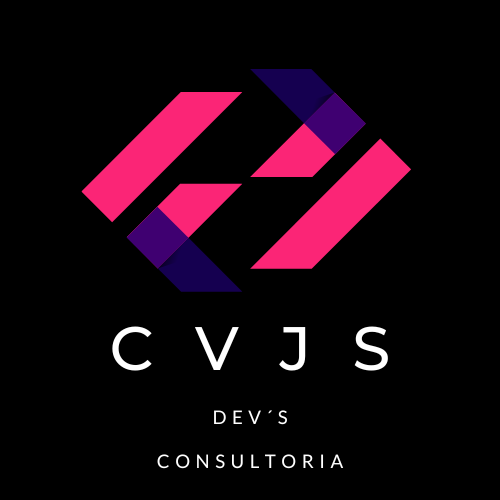

# Título del Proyecto

_Acá va un párrafo que describa lo que es el proyecto_

```
[API](http://www.dropwizard.io/1.0.2/docs/)
```

### Dailys 📋

```
Todos los días después de clase y fines de semana para temas de dudas o estancados en problemas.
```

## Tecnologías usadas 🛠️

* [Dropwizard](http://www.dropwizard.io/1.0.2/docs/) - El framework web usado
* [Maven](https://maven.apache.org/) - Manejador de dependencias
* [ROME](https://rometools.github.io/rome/) - Usado para generar RSS

### Estilos y Fuentes ⌨️

```
Da un ejemplo
```
```
Da un ejemplo
```
```
Da un ejemplo
```
```
Da un ejemplo
```
## Wireframe de baja 🚀


## Wireframe de alta 

## Despliegue 📦

_Agrega notas adicionales sobre como hacer deploy_


## Autores ✒️

_Menciona a todos aquellos que ayudaron a levantar el proyecto desde sus inicios_

* **Fulanito Detal** - *Documentación* - [fulanitodetal](#fulanito-de-tal)
[](https://www.linkedin.com/)

* **Fulanito Detal** - *Documentación* - [fulanitodetal](#fulanito-de-tal)
[](https://www.linkedin.com/)

* **Fulanito Detal** - *Documentación* - [fulanitodetal](#fulanito-de-tal)
[](https://www.linkedin.com/)

* **Fulanito Detal** - *Documentación* - [fulanitodetal](#fulanito-de-tal)
[](https://www.linkedin.com/)


## Expresiones de Gratitud 🎁

* Comenta a otros sobre este proyecto 📢
* Invita una cerveza 🍺 o un café ☕ a alguien del equipo. 
* Da las gracias públicamente 🤓.
* etc.


---
❤️ 